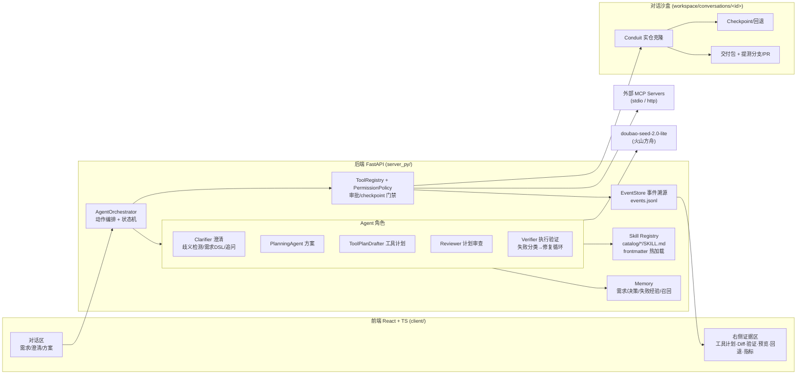

# AI Delivery Workbench

一个可以端到端交付全栈项目的"超级个体"平台:产品经理用自然语言提需求,系统在独立沙盒中完成 **需求澄清 → 方案生成 → 工具计划 → 用户确认 → 代码修改 → 自动验证 → 浏览器预览 → 交付/提测(PR) → 可回退** 的完整闭环。实验田为开源全栈博客 [Conduit](https://github.com/TonyMckes/conduit-realworld-example-app)(React + Express + Sequelize monorepo)。

## 快速开始

依赖:Node.js 18+、Python 3.11+(3.13 已验证)、git。

```bash
# 1. 安装依赖
npm install
pip install -r server_py/requirements.txt

# 2. 配置 API Key(复制 .env.example 为 .env,填入比赛下发的 ARK_API_KEY)
copy .env.example .env

# 3. 一起启动前后端
npm run dev
# 前端 http://127.0.0.1:5173  后端 http://127.0.0.1:4317
```

修改过后端代码必须重启 `npm run dev:server`(历史上一次 `/api/mcp/config` 404 正是旧进程未重启导致)。

### API Key 配置位置

| 配置 | 位置 | 说明 |
|---|---|---|
| `ARK_API_KEY` | 项目根目录 `.env` | 火山方舟 doubao-seed-2.0-lite,**仅限本课题使用** |
| `ARK_MODEL` | `.env`(可选) | 覆盖 EP id,默认取 `config/model-providers.json` |
| `GITHUB_TOKEN` | `.env`(可选) | 配置后提测链路自动 push 分支并创建 GitHub PR;未配置则产出 PR-ready 分支 + patch |

`.env` 已被 gitignore,不会进入仓库。

## 架构



三层结构:**前端对话页**(client/)+ **服务端运行时**(server_py/,FastAPI)+ **AI 编排层**(Skill / Agent / Orchestrator)。每个对话拥有独立沙盒,所有写入先建 checkpoint,所有关键动作进事件流。

## 目录结构

```
client/              React 前端(chat / inspector / sidebar / workbench)
server_py/
  agent/             Orchestrator、Planning/Executor、Clarifier/Reviewer/Verifier、工具计划
  skills/catalog/    Skill 文件(每个目录一个 SKILL.md,frontmatter 即注册)
  runtime/           权限策略、事件流、状态机、审批
  tools/             code.* / command.run / verification.run / browser.preview_smoke / github.*
  sandbox/           沙盒管理、checkpoint、diff、回退
  delivery/          交付包、应用回原仓库、提测分支/PR(git_submission)
  memory/            需求/决策/失败经验/上下文包/相似召回
  mcp/               MCP 适配(stdio 换行帧 + http)
  observability/     每次模型调用的 tokens/延迟/成本(metrics.jsonl)
  verification/      栈检测 + 验证命令执行
  preview/           预览进程 + 浏览器 smoke(截图/DOM/控制台/断言)
  tests/             后端测试套件(pytest)
shared/              前后端共享 TypeScript 类型
config/              模型/价格/权限策略/MCP 配置
docs/                设计文档(阅读顺序见 docs/README.md)
workspace/           对话沙盒与运行证据(gitignore)
```

## Skill 体系:新增需求模式 = 新增 1 个文件

每个 Skill 是 `server_py/skills/catalog/<id>/SKILL.md`,YAML frontmatter 即注册信息,**保存即热加载,不改主干、不重启**:

```markdown
---
id: pattern-xxx
kind: requirement-pattern        # process | repo-profile | requirement-pattern
triggers: [关键词1, 关键词2]
clarifyChecklist:                # 喂给澄清 Agent 的模式专属追问
  - "字段挂在哪个实体上？"
antiPatterns:                    # 反模式识别(自相矛盾需求)
  - "说不动后端但要持久化——必须指出矛盾"
locateStrategy:                  # 模块定位锚点(真实路径)
  backend: ["backend/models/<Entity>.js 的 init 字段块"]
changeChecklist: [...]           # 跨栈改动清单
verification: ["npm test -- --run"]
acceptance: [...]                # 验收断言
---
# 正文:流程 + 硬限制(注入模型上下文)
```

内置 11 个 Skill:4 个流程型(交付流程/仓库上下文/预览/回退)+ 1 个 Conduit 仓库画像 + 6 个需求模式(全栈新增字段 / 纯前端展示 / 新增页面 Tab / 列表筛选 / 幂等计数交互 / 时间与相对时间展示),全部基于 Conduit 真实结构编写。

模式 Skill 的 `clarifyChecklist` 会直接强化澄清 Agent:即使模型暂时不可用,规则兜底也能给出模式专属的具体追问。

**活案例**(全程留痕在 git 与事件流):第 11 个 skill `pattern-time-display` 是在系统运行期间写入的——文件落盘后未重启,`/api/skills` 立即识别,随后的托管任务在 `skill_runtime.selected` 事件中选中该模式,3.3 分钟产出测试全绿的提测分支;且生成代码遵守了该 skill 的硬限制(相对时间纯函数带 `now` 注入参数、复用 dateFormatter、零新依赖)——**Skill 约束真实塑造了代码,不是展示文案**。

## 完成判定:不是"看起来对"

- **代码级(默认)**:写入完成 + 真实 vitest 单测通过,推进循环才允许结束;托管交付前还会**重新跑一遍完整验证**(终检),杜绝旧报告误判。
- **页面级(预览开启时)**:autopilot 自动运行浏览器断言(visual gate)——需求要求的可见文案/元素真的出现在页面上才算 pass,附截图与运行后 DOM 证据;无预览进程时如实标记 skipped 并说明判定依据。

## 托管模式:一条指令直达提测

勾选对话输入区的「托管模式」(或调用 `POST /api/agent/autopilot`),一条需求指令自动走完:

```
方案生成 → 自动确认 → 工具计划 → 自动确认 → 执行(checkpoint)
→ 修复/推进循环(自动接力) → 验证通过 → 交付包 → 提测分支/PR
```

- 每一次自动确认都以 `actor=autopilot` 写入事件流,全程可审计、可回退。
- 安全停车点:需求有阻断性歧义(澄清问题必须人答)、Reviewer 阻断计划、修复轮次到上限、危险命令——托管会停下并说明原因,绝不硬闯。
- 人工模式(逐步确认)完整保留,两种模式同一条链路、同一套证据。

## 端到端使用流程(PM 视角)

1. 新建对话,接入仓库(本地路径或 GitHub URL),系统创建独立沙盒。
2. 用自然语言输入需求;Clarifier 检查六个歧义维度 + 命中模式的 checklist,需求不清时**在对话里直接追问**(不浪费一次规划调用),自相矛盾时指出矛盾并给可选路径。
3. 需求可执行后生成中文方案(需求确认/澄清/计划/风险),用户确认。
4. 系统产出可审查的工具调用计划(每步工具/输入/风险/checkpoint),Reviewer 审查,用户确认后执行。
5. 写入前自动 checkpoint;执行后跑验证命令 + 浏览器 smoke(截图/DOM/断言);失败自动分类并生成下一轮待确认修复计划。
6. 生成交付包(diff/patch/报告),一键生成提测分支;配置 GITHUB_TOKEN 时自动创建 PR,否则产出 PR-ready 分支 + `submission.patch` + `pr-description.md`。
7. 任意时刻可按 checkpoint 回退单文件/hunk,或确认后全仓回到沙盒原始 HEAD。

## 测试与验证

```bash
npm run test:server   # 后端 pytest 套件(skill 注册/权限矩阵/澄清规则/提测链路等)
npm run typecheck     # shared build + python compileall + 前端 tsc
npm run build         # 全量构建
```

## 可观测性

每次模型调用记录 tokens / 延迟 / 成本到 `workspace/conversations/<id>/metrics.jsonl`,前端指标面板展示 token 总量、平均/最大延迟、模型总耗时、输入输出拆分与估算成本;工具调用同样计量。成本单价在 `config/model-pricing.json` 配置(未配置时面板明示"成本待配价")。

## 性能:同一任务的三轮真实优化记录

同一道 L1 需求(Popular Tags 前 5 打标),托管模式一条指令,全程真实 doubao-seed-2.0-lite:

| 版本 | 模型调用 | Token 总量 | 平均输入/次 | 模型总耗时 |
|---|---|---|---|---|
| 基线 | 18 次 | 114.5 万 | 62,146 | 11.1 分钟 |
| + 上下文裁剪(记忆精简视图,-91% 注入) | 15 次 | 15.4 万 | 8,860 | 6.3 分钟 |
| **+ 只读计划规则快审(跳过模型审计)** | **12 次** | **11.5 万** | **8,263** | **4.6 分钟** |

净效果:**耗时 -58%、Token -90%、平均输入上下文 -87%**,需求质量与验证门禁不变。优化手段(均有提交记录可溯):喂模型的记忆从全量转储(13.8 万字符)裁剪为检索后的精简视图(1.2 万字符);只读侦察计划改走规则快速审计,不动用模型;`max_tokens` 16k 防多文件计划截断;平台命令规则防 Unix/Windows 不兼容空转。这套优化本身就是用平台**自带的可观测性面板**(token/延迟/成本)定位并验证的——可观测性不只是展示,而是真正驱动了工程决策。

## 评分锚点对照(全部有真实运行证据)

| 锚点 / L3 能力 | 实现 | 证据位置 |
|---|---|---|
| 新增需求模式仅 1 个 Skill 文件 | catalog 目录扫描 + frontmatter 热加载,零改主干零重启 | 活案例:运行期写入第 11 个 skill 后 3.3 分钟交付(events: `skill_runtime.selected`);自动化测试 `test_hot_reload_new_skill_file` |
| 断点重放 / 事件溯源 | events.jsonl 全量事件;计划可编辑/自然语言重写/暂停/重放;checkpoint 文件级/hunk 级/全仓回退 | `workspace/conversations/*/events.jsonl`;ToolPlanPanel 编辑与重写入口 |
| 跨栈一致性 | add-field 模式 skill 的跨栈 changeChecklist 驱动迁移→模型→接口→前端表单/展示一次贯通 | L2 实跑:coverImage 6 文件手术式 diff(`workbench/conv_e2e_l2`) |
| 每次 AI 调用记录 tokens/延迟/成本 | metrics.jsonl + 指标面板(总量/平均延迟/最慢/输入输出拆分) | 性能三连优化正是用该面板定位的(上表) |
| 业务上下文反哺:相似需求召回旧方案 | 交付成功自动沉淀"需求→改动文件→验证→分支"为高权重长期记忆,跨会话按相似度召回进模型上下文 | 实测:新会话提相似需求,召回 2 条历史"已交付方案"(score 400+)与失败经验;澄清 Agent 曾引用历史失败避免重复踩坑 |
| L3·模糊需求主动澄清 | 六维歧义清单+模式专属 checklist,blocked 时短路追问(带选项) | 实跑:模糊"加个字数统计"被连续追问位置/来源/形态/空值 |
| L3·多模块协同拆解 | 澄清产出需求 DSL(dataChanges/apiChanges/uiChanges);模式 skill 带跨栈变更清单;先侦察后读取后写入分轮推进 | L2 与 autopilot 运行的计划链(events) |
| L3·反模式识别 | 矛盾检测(规则+模型),指出冲突并给可选实现路径,不硬编 | 实跑:"存数据库但不动后端"被判 blocked,模型给出 A 全栈/B 纯前端两条路径供选择 |

## AI 使用与合规声明

- **运行时主模型**:doubao-seed-2.0-lite(火山方舟,比赛统一下发 EP/API Key,仅用于本课题)。
- **开发期 AI 辅助**:使用 Claude Code 进行代码库审查、框架重构与测试编写;所有 AI 生成代码均经人工审阅后提交,过程记录见 `docs/ai-usage.md` 与 git 提交历史。
- **技术栈说明**:平台服务端为 Python FastAPI(选型动机:复用/移植 Codex 运行时机制做研究性实现,见 docs/08、docs/09),前端与工具链为 Node 生态(React/Vite/TS workspaces)。已知课题简介中"三端齐备"表述为"前端对话页 + Node 后端 + AI 编排",**服务端语言差异已在此显式声明**;如评审对服务端语言有硬性要求,请以课题群确认结论为准。
- 沙盒只读写 `workspace/` 内目录;危险命令(reset/clean/删除类)被权限层拦截,必须走专门回退接口并显式确认。
