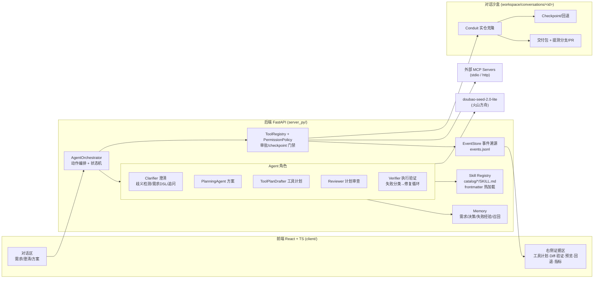

# AI Delivery Workbench

一个可以端到端交付全栈项目的"超级个体"平台:产品经理用自然语言提需求,系统在独立沙盒中完成 **需求澄清 → 方案生成 → 工具计划 → 用户确认 → 代码修改 → 自动验证 → 浏览器预览 → 交付/提测(PR) → 可回退** 的完整闭环。实验田为开源全栈博客 [Conduit](https://github.com/TonyMckes/conduit-realworld-example-app)(React + Express + Sequelize monorepo)。

## 快速开始

依赖:Node.js 18+、Python 3.11+(3.13 已验证)、git。

```bash
# 1. 安装依赖
npm install
pip install -r server_py/requirements.txt

# 2. 配置 API Key(复制 .env.example 为 .env,填入比赛下发的 ARK_API_KEY)
copy .env.example .env

# 3. 一起启动前后端
npm run dev
# 前端 http://127.0.0.1:5173  后端 http://127.0.0.1:4317
```

修改过后端代码必须重启 `npm run dev:server`(历史上一次 `/api/mcp/config` 404 正是旧进程未重启导致)。

### API Key 配置位置

| 配置 | 位置 | 说明 |
|---|---|---|
| `ARK_API_KEY` | 项目根目录 `.env` | 火山方舟 doubao-seed-2.0-lite,**仅限本课题使用** |
| `ARK_MODEL` | `.env`(可选) | 覆盖 EP id,默认取 `config/model-providers.json` |
| `GITHUB_TOKEN` | `.env`(可选) | 配置后提测链路自动 push 分支并创建 GitHub PR;未配置则产出 PR-ready 分支 + patch |

`.env` 已被 gitignore,不会进入仓库。

## 架构



三层结构:**前端对话页**(client/)+ **服务端运行时**(server_py/,FastAPI)+ **AI 编排层**(Skill / Agent / Orchestrator)。每个对话拥有独立沙盒,所有写入先建 checkpoint,所有关键动作进事件流。

## 目录结构

```
client/              React 前端(chat / inspector / sidebar / workbench)
server_py/
  agent/             Orchestrator、Planning/Executor、Clarifier/Reviewer/Verifier、工具计划
  skills/catalog/    Skill 文件(每个目录一个 SKILL.md,frontmatter 即注册)
  runtime/           权限策略、事件流、状态机、审批
  tools/             code.* / command.run / verification.run / browser.preview_smoke / github.*
  sandbox/           沙盒管理、checkpoint、diff、回退
  delivery/          交付包、应用回原仓库、提测分支/PR(git_submission)
  memory/            需求/决策/失败经验/上下文包/相似召回
  mcp/               MCP 适配(stdio 换行帧 + http)
  observability/     每次模型调用的 tokens/延迟/成本(metrics.jsonl)
  verification/      栈检测 + 验证命令执行
  preview/           预览进程 + 浏览器 smoke(截图/DOM/控制台/断言)
  tests/             后端测试套件(pytest)
shared/              前后端共享 TypeScript 类型
config/              模型/价格/权限策略/MCP 配置
docs/                设计文档(阅读顺序见 docs/README.md)
workspace/           对话沙盒与运行证据(gitignore)
```

## Skill 体系:新增需求模式 = 新增 1 个文件

每个 Skill 是 `server_py/skills/catalog/<id>/SKILL.md`,YAML frontmatter 即注册信息,**保存即热加载,不改主干、不重启**:

```markdown
---
id: pattern-xxx
kind: requirement-pattern        # process | repo-profile | requirement-pattern
triggers: [关键词1, 关键词2]
clarifyChecklist:                # 喂给澄清 Agent 的模式专属追问
  - "字段挂在哪个实体上？"
antiPatterns:                    # 反模式识别(自相矛盾需求)
  - "说不动后端但要持久化——必须指出矛盾"
locateStrategy:                  # 模块定位锚点(真实路径)
  backend: ["backend/models/<Entity>.js 的 init 字段块"]
changeChecklist: [...]           # 跨栈改动清单
verification: ["npm test -- --run"]
acceptance: [...]                # 验收断言
---
# 正文:流程 + 硬限制(注入模型上下文)
```

内置 10 个 Skill:4 个流程型(交付流程/仓库上下文/预览/回退)+ 1 个 Conduit 仓库画像 + 5 个需求模式(全栈新增字段 / 纯前端展示 / 新增页面 Tab / 列表筛选 / 幂等计数交互),全部基于 Conduit 真实结构编写。

模式 Skill 的 `clarifyChecklist` 会直接强化澄清 Agent:即使模型暂时不可用,规则兜底也能给出模式专属的具体追问。

## 端到端使用流程(PM 视角)

1. 新建对话,接入仓库(本地路径或 GitHub URL),系统创建独立沙盒。
2. 用自然语言输入需求;Clarifier 检查六个歧义维度 + 命中模式的 checklist,需求不清时**在对话里直接追问**(不浪费一次规划调用),自相矛盾时指出矛盾并给可选路径。
3. 需求可执行后生成中文方案(需求确认/澄清/计划/风险),用户确认。
4. 系统产出可审查的工具调用计划(每步工具/输入/风险/checkpoint),Reviewer 审查,用户确认后执行。
5. 写入前自动 checkpoint;执行后跑验证命令 + 浏览器 smoke(截图/DOM/断言);失败自动分类并生成下一轮待确认修复计划。
6. 生成交付包(diff/patch/报告),一键生成提测分支;配置 GITHUB_TOKEN 时自动创建 PR,否则产出 PR-ready 分支 + `submission.patch` + `pr-description.md`。
7. 任意时刻可按 checkpoint 回退单文件/hunk,或确认后全仓回到沙盒原始 HEAD。

## 测试与验证

```bash
npm run test:server   # 后端 pytest 套件(skill 注册/权限矩阵/澄清规则/提测链路等)
npm run typecheck     # shared build + python compileall + 前端 tsc
npm run build         # 全量构建
```

## 可观测性

每次模型调用记录 tokens / 延迟 / 成本到 `workspace/conversations/<id>/metrics.jsonl`,前端指标面板可查;工具调用同样计量。成本单价在 `config/model-pricing.json` 配置(未配置时显示 0)。

## AI 使用与合规声明

- **运行时主模型**:doubao-seed-2.0-lite(火山方舟,比赛统一下发 EP/API Key,仅用于本课题)。
- **开发期 AI 辅助**:使用 Claude Code 进行代码库审查、框架重构与测试编写;所有 AI 生成代码均经人工审阅后提交,过程记录见 `docs/ai-usage.md` 与 git 提交历史。
- **技术栈说明**:平台服务端为 Python FastAPI(选型动机:复用/移植 Codex 运行时机制做研究性实现,见 docs/08、docs/09),前端与工具链为 Node 生态(React/Vite/TS workspaces)。已知课题简介中"三端齐备"表述为"前端对话页 + Node 后端 + AI 编排",**服务端语言差异已在此显式声明**;如评审对服务端语言有硬性要求,请以课题群确认结论为准。
- 沙盒只读写 `workspace/` 内目录;危险命令(reset/clean/删除类)被权限层拦截,必须走专门回退接口并显式确认。
